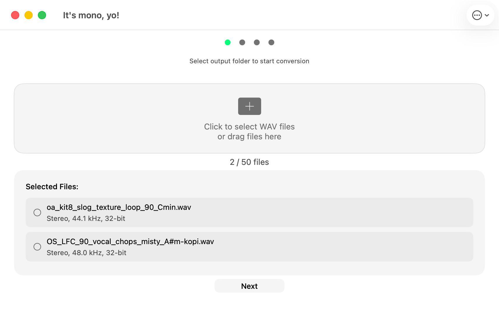

# It's mono, yo!


**Open-source** macOS app for batch converting stereo WAV and AIFF audio files to mono with configurable bit depth, sample rate, and output format. Built for hardware samplers like the Erica Synths Sample Drum, Elektron Digitakt, Elektron Model:Samples, Roland SP-404, and Eurorack modules.

[Website](https://itsmonoyo.iamjarl.com) · [Mac App Store](https://apps.apple.com/app/its-mono-yo/id6758866918?mt=12) · [Report Issue](https://github.com/JarlLyng/It-s-mono-yo-/issues)



## Distribution

- **Mac App Store** (paid) — recommended, includes automatic updates
- **Build from source** — clone this repo and build in Xcode (see below)

There are no pre-built binaries on GitHub. The Mac App Store is the only way to get a ready-to-run build.

## Features

- **Batch conversion** — drag in unlimited WAV and AIFF files
- **Configurable bit depth** — 16-bit (default), 24-bit, or 32-bit float output
- **Output format** — WAV or AIFF
- **Sample rate conversion** — keep original, or convert to 44.1 / 48 / 96 kHz
- **Intelligent downmix** — proper stereo summing (not just left channel)
- **Multi-channel support** — weighted downmix using ITU-R BS.775 coefficients for surround audio
- **Overwrite protection** — existing files are auto-renamed, never replaced
- **Drag and drop** — drop files directly into the app
- **Keyboard shortcuts** — ⌘O to open, ESC to go back
- **Accessibility** — VoiceOver, Reduce Motion, system dark mode
- **Native macOS** — built with SwiftUI, lightweight, no internet required

## System Requirements

- macOS 11.0 (Big Sur) or later
- Apple Silicon or Intel
- Input/output formats: WAV and AIFF

## Build from Source

1. Clone the repository:
   ```bash
   git clone https://github.com/JarlLyng/It-s-mono-yo-.git
   ```
2. Open `It's mono, yo!.xcodeproj` in Xcode 16+
3. Select your development team in Signing & Capabilities
4. Build and run (⌘R)

> **Note:** The project uses `PBXFileSystemSynchronizedRootGroup` (Xcode 16+). New source files are automatically included in the build.

## Usage

1. Launch the app
2. Add audio files — click "Select Files" (⌘O) or drag and drop WAV/AIFF files
3. Configure output settings (format, bit depth, sample rate)
4. Choose an output folder
5. Click Convert
6. Open converted files with "Show in Finder"

## Architecture

### Source Files

```
SampleDrumConverter/
├── ItsMonoYoApp.swift          # App entry point
├── ContentView.swift            # Main UI: file selection, output settings, conversion flow
├── AudioConverter.swift         # Audio engine: ExtAudioFile conversion, downmix, overwrite protection
├── OutputSettings.swift         # Output config model: bit depth, file type, sample rate enums
├── ReducedMotion.swift          # Accessibility: adaptive animation respecting Reduce Motion
├── DesignTokens.swift           # IAMJARL Design System color and spacing tokens
└── Assets.xcassets/             # App icon and accent color

SampleDrumConverterTests/
├── SampleDrumConverterTests.swift   # Basic app tests
└── AudioConversionTests.swift       # Conversion tests: bit depth, AIFF, sample rate, overwrite
```

### Key Technical Decisions

- **AudioToolbox / ExtAudioFile** — used instead of AVFoundation for precise control over bit depth and format conversion. ExtAudioFile handles sample format conversion via client format (float32 intermediate).
- **Float32 intermediate processing** — both input and output ExtAudioFiles use float32 client format. This lets ExtAudioFile handle all bit depth packing/unpacking automatically.
- **AIFF-C for float output** — standard AIFF doesn't support 32-bit float. The app uses `kAudioFileAIFC_Type` when outputting float AIFF.
- **ITU-R BS.775 weighted downmix** — multi-channel audio (surround) is downmixed using broadcast-standard coefficients, not just averaged.
- **Overwrite protection** — `resolveOutputURL()` appends ` (1)`, ` (2)`, etc. to filenames if output already exists.
- **Reduce Motion** — `AdaptiveAnimationModifier` uses `@Environment(\.accessibilityReduceMotion)` on macOS 12+ with `NSWorkspace` fallback for macOS 11.

### Module Name

The Xcode module name is `It_s_mono__yo_` (derived from the product name). Tests import with `@testable import It_s_mono__yo_`.

## Current Version

**v1.2.0** (build 12) — April 2026

### What's New in v1.2
- Configurable output bit depth (16-bit, 24-bit, 32-bit float)
- AIFF input and output support
- Sample rate conversion (44.1 / 48 / 96 kHz)
- No file count or size limits
- Overwrite protection with auto-rename
- Weighted multi-channel downmix (ITU-R BS.775)
- Reduce Motion accessibility support
- Code architecture: extracted AudioConverter, OutputSettings, ReducedMotion from ContentView

### Previous Versions
- **v1.0.8** — App Store release with sandbox and accessibility
- **v1.0.7** — Removed AudioKit dependency, async/await conversion, semantic versioning fix

## Branches

- **`main`** — app source code and documentation
- **`gh-pages`** — marketing website (itsmonoyo.iamjarl.com), served by GitHub Pages

Both branches contain the app source code. The `gh-pages` branch additionally contains the website HTML files.

## Contributing

Contributions are welcome:

1. Fork the repository
2. Create a feature branch (`git checkout -b feature/your-feature`)
3. Commit your changes
4. Push and open a [Pull Request](https://github.com/JarlLyng/It-s-mono-yo-/compare)

See [.github/pull_request_template.md](.github/pull_request_template.md) for the PR template.

## Documentation

| File | Purpose |
|------|---------|
| [APP_ACCESSIBILITY.md](APP_ACCESSIBILITY.md) | App Store accessibility nutrition labels checklist |
| [APP_STORE_ENTITLEMENTS.md](APP_STORE_ENTITLEMENTS.md) | Entitlements and sandbox documentation for App Review |
| [XCODE_CLOUD.md](XCODE_CLOUD.md) | Setting up Xcode Cloud CI |
| [SEO_STRATEGY.md](SEO_STRATEGY.md) | SEO and App Store optimization strategy |

## License

MIT License — see [LICENSE](LICENSE) for details.

## Support

- **Bugs & feature requests:** [GitHub Issues](https://github.com/JarlLyng/It-s-mono-yo-/issues)
- **Website:** [itsmonoyo.iamjarl.com](https://itsmonoyo.iamjarl.com)
- **Mac App Store:** [Download](https://apps.apple.com/app/its-mono-yo/id6758866918?mt=12)
